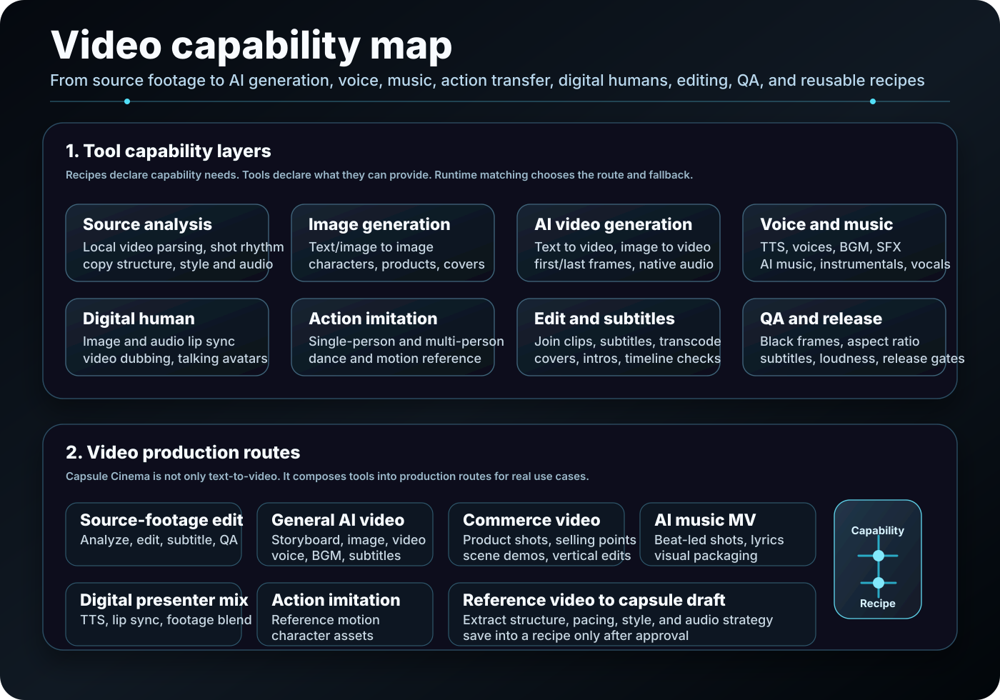
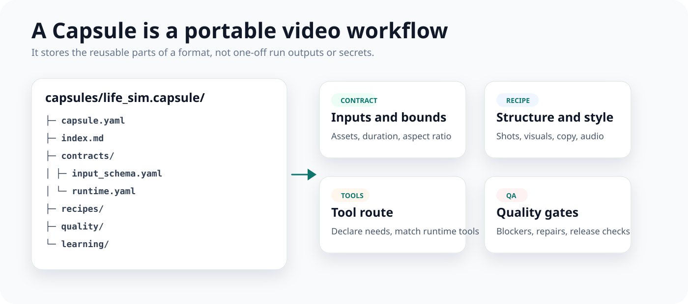

# Capsule Cinema

**An AI video production factory for turning proven workflows into reusable video recipes.**

Capsule Cinema is for creators and teams who make short videos repeatedly. It organizes briefs, assets, tool capabilities, and quality rules into reusable Capsules, so a proven format can keep its structure while the topic, material, and style change.

  <a href="./README.md">中文</a> ·
  
  
  
  

  <a href="#demo">Demo</a> ·
  <a href="#why-capsule-cinema">Why</a> ·
  <a href="#what-it-does">What it does</a> ·
  <a href="#video-capability-map">Capability map</a> ·
  <a href="#video-recipes">Recipes</a> ·
  <a href="#custom-tools">Custom tools</a> ·
  <a href="#how-it-works">How it works</a> ·
  <a href="#quick-start">Quick Start</a> ·
  <a href="#community">Community</a>

Capsule Cinema is not a one-shot video generator. It is a reusable production system: it breaks creation into storyboards, tool routes, audio strategy, quality rules, and rework lessons, then stores the stable parts as a recipe.

## Demo

These samples come from built-in starter recipes. They show the range Capsule Cinema can cover across channel formats, product videos, art motion, and stylized short films.

<table>
  <tbody>
    <tr>
      <td width="62%" valign="top">
        <video width="100%" controls src="https://github.com/user-attachments/assets/d81e88b3-a567-4835-9784-c2a65f4fe977"></video>
      </td>
      <td width="38%" valign="top">
        <strong>Life-simulation shorts</strong>
          
        Workplace stories, everyday empathy clips, animated narration, and fast multi-scene edits.
          
        Best for hook-driven openings, emotional progression, unified TTS pacing, and repeatable channel formats.
      </td>
    </tr>
  </tbody>
</table>

<table width="100%">
  <tbody>
    <tr>
      <td width="50%" valign="top" align="center">
        <video width="260" controls src="https://github.com/user-attachments/assets/c7722195-0c14-4478-aeb8-b5e950518669"></video>
         
        <strong>Commerce product videos</strong>
         
        Selling points, use cases, product demos, and short-form commerce clips.
      </td>
      <td width="50%" valign="top" align="center">
        <video width="260" controls src="https://github.com/user-attachments/assets/5fff44fe-97e5-41e4-a966-2c8565926d89"></video>
         
        <strong>Art image motion</strong>
         
        Motion design from illustrations, posters, start frames, and end frames.
      </td>
    </tr>
    <tr>
      <td width="50%" valign="top" align="center">
        <video width="260" controls src="https://github.com/user-attachments/assets/b5c672be-cacb-4877-a688-e6d7baa1a3b5"></video>
         
        <strong>Chinese history explainers</strong>
         
        Cultural storytelling, historical topics, voiceover narration, and stylized visuals.
      </td>
      <td width="50%" valign="top" align="center">
        <video width="260" controls src="https://github.com/user-attachments/assets/59f4c71c-9634-4b9f-8b48-e47f7a7c1d5f"></video>
         
        <strong>Felt craft ASMR</strong>
         
        Handmade food, soft textures, close-up details, and calm pacing.
      </td>
    </tr>
  </tbody>
</table>

## Why Capsule Cinema

One-off prompts can make a single video, but they do not scale well into repeatable formats. Real channel, product, and team work usually runs into these problems:

| Real problem | Capsule Cinema approach |
| --- | --- |
| Every episode starts from scratch | Save the working format in a Capsule |
| Video providers change quickly | Recipes describe required capabilities; runtime matches available tools |
| Direction is hard to review before generation | Create a reviewable storyboard before media generation |
| One bad shot forces a full rerun | Rework one shot, BGM, subtitles, or edit plan without restarting |
| Release quality is mostly manual | Produce quality checks, repair suggestions, and release checkpoints |
| Reference videos are easy to copy too closely | Analyze structure, rhythm, style, and audio strategy before creating a capsule draft |

## What it does

| Video direction | Creative capabilities |
| --- | --- |
| Real-footage editing | Turns existing clips, references, subtitles, BGM, and pacing requirements into a reviewable edit plan |
| General AI video creation | Builds storyboards, images, video shots, voice, subtitles, edits, and QA from a topic and audience |
| Commerce videos | Structures selling points, product scenes, narration rhythm, product images, and demo shots |
| AI music videos | Designs shots around lyrics, beats, mood sections, and visual style for music videos and vibe clips |
| Digital-human explainers | Combines digital-human narration, product B-roll, subtitle cards, visual information, and real footage |
| Action mimicry and dance | Uses reference motion, character consistency, beat timing, and shot continuity for motion-led videos |
| Reference-to-capsule drafting | Analyzes shot rhythm, copy structure, visual style, and audio strategy, then creates a reviewable recipe draft |
| Targeted rework | Changes one shot, voice, BGM, or edit plan without remaking the whole video |

## Video capability map

This capability map breaks video work into content types, generation capabilities, and delivery checks. It also makes the tool boundary clear: image generation, AI video generation, TTS, AI music, real-footage editing, digital humans, action mimicry, and QA can be combined instead of locked to one platform.

## Video recipes

A Capsule is a portable video workflow, not a finished video. It stores the reusable parts of a format: use case, storyboard structure, visual style, audio strategy, tool route, quality rules, rework lessons, and safety boundaries.

Common recipe directions:

| Recipe direction | Best for |
| --- | --- |
| Channel formats | Repeatable series, narrative voiceover, explainers, and recurring topics |
| Product showcase | Selling points, use cases, comparison shots, and commerce clips |
| Art motion | Illustration motion, poster motion, start/end-frame transitions, and visual experiments |
| Chinese history | Historical stories, cultural explainers, stylized visuals, and narrated short videos |
| Craft and ASMR | Felt craft, handmade food, close-up detail, and soft audio-visual pacing |
| AI music videos | Lyric visualization, beat-driven cuts, concept films, and mood clips |
| Digital-human mixes | Presenter narration, product footage, subtitle cards, brand explainers, and B-roll edits |
| Action mimicry | Dance, pose transfer, character performance, and beat-led challenge videos |

Recipes can come from three places:

| Source | Use |
| --- | --- |
| Starter recipes | Begin quickly from seed examples included in the project |
| Personal recipes | Distill successful work into channel, brand, or project know-how |
| Community recipes | Share, test, and improve public production methods |

When you reuse a recipe, swap the topic, assets, and episode copy while keeping the proven structure. A recipe should not store API keys, cookies, client data, private assets, temporary links, or one-off run outputs.

## Custom tools

AI video tools change quickly, so recipes do not bind themselves to one vendor. A recipe describes the capability it needs, each tool declares what it can do, and the runtime matches them.

| Capability layer | Tools you can connect | Video types supported |
| --- | --- | --- |
| Image generation | Text-to-image, image-to-image, product images, covers, and stylized images | General AI video, commerce, history, art motion |
| AI video generation | Text-to-video, image-to-video, start/end frames, shot extension, and transitions | General creation, art films, narrative shorts, product demos |
| Real-footage editing | Clip selection, assembly, subtitles, transcoding, covers, and pacing edits | Real-footage edits, event recaps, product cases, presenter B-roll |
| TTS and digital humans | Multi-voice narration, presenters, lip sync, digital hosts, and mixed human footage | Explainers, commerce narration, brand videos, story voiceover |
| AI music and BGM | Music generation, BGM, sound effects, beat points, and mood sections | Music videos, mood clips, ASMR, narrative transitions |
| Action mimicry | Pose references, dance motion, character consistency, and motion timing checks | Dance videos, motion transfer, character acting, challenge clips |
| Quality checks | Black frames, aspect ratio, subtitle occlusion, loudness, duration, language match, and release checks | Any video that needs stable delivery |
| Credentials and fallback routes | Credential checks, capability matching, fallback paths, and user confirmation | Multi-provider production, team workflows, batch delivery |

If a tool is unavailable, Capsule Cinema can list fallback routes. Downgrades that need user approval pause first.

## How it works

| Stage | What happens |
| --- | --- |
| Brief understanding | Organize audience, topic, assets, style, and publishing context into production requirements |
| Recipe selection | Choose an existing Capsule, or draft a new one from a reference video and goal |
| Storyboard review | Confirm shot structure, copy rhythm, visual direction, and audio strategy first |
| Tool orchestration | Match image, video, TTS, music, editing, digital-human, and QA tools by capability |
| Quality gates | Check aspect ratio, duration, subtitles, audio, shot completeness, and recipe constraints |
| Experience writeback | Feed rework causes, useful structures, and release checks back into the recipe |

## Quick Start

After installing the repository as an OpenClaw skill, describe the video you want in conversation. These prompts stay at the product-use level, so you do not need to remember any local entry points.

| Goal | Say this |
| --- | --- |
| Storyboard first | "Only create the storyboard for now. Do not generate images, video, or voice yet. The topic is [topic]. I will review it before production continues." |
| Full video | "Use Capsule Cinema to make a [duration] second [landscape or vertical] video about [topic], focusing on [value point]." |
| Choose a capability route | "For this run, prioritize [image generation, AI video, TTS, AI music, real-footage editing, digital human, or action mimicry]. Give me a reviewable production route first." |
| Use real footage | "I have a set of source clips. Turn them into a short video for [use case], keep useful shots, and add subtitles, BGM, pacing, and release checks." |
| Make a commerce video | "Create a product seeding video for [product]. The audience is [audience], the selling points are [selling points], and the style should be [style]." |
| Make an AI music video | "Create a music video for this song. Design shots around lyric sections and beats. The visual style is [style]." |
| Make a digital-human explainer | "Use a digital-human presenter plus product B-roll to make an explainer. The tone should be [tone], and it must explain [information]." |
| Make an action-mimicry video | "Use this action or dance reference to create a [character or topic] motion short. Pay attention to motion rhythm and character consistency." |
| Analyze a reference video | "Analyze this reference video, extract shot rhythm, copy structure, visual style, and audio strategy, then create a capsule draft first." |
| Rework one shot | "I do not like scene [number] from the last video. Keep everything else and regenerate only that scene: [change request]." |
| Save as a recipe | "I am happy with this video. Save it as [recipe name] for future [use case] videos." |

If you are not sure which recipe to use, describe the goal, assets, style, and delivery context. Capsule Cinema will propose a reviewable production route before generation.

## Community

Use [GitHub Issues](https://github.com/JuneYaooo/capsule-cinema/issues) to share recipe ideas, run problems, sample videos, or improvement requests.

Chinese developer community: [LINUX DO](https://linux.do/)

## License

PolyForm Noncommercial License 1.0.0. See [LICENSE](./LICENSE).
