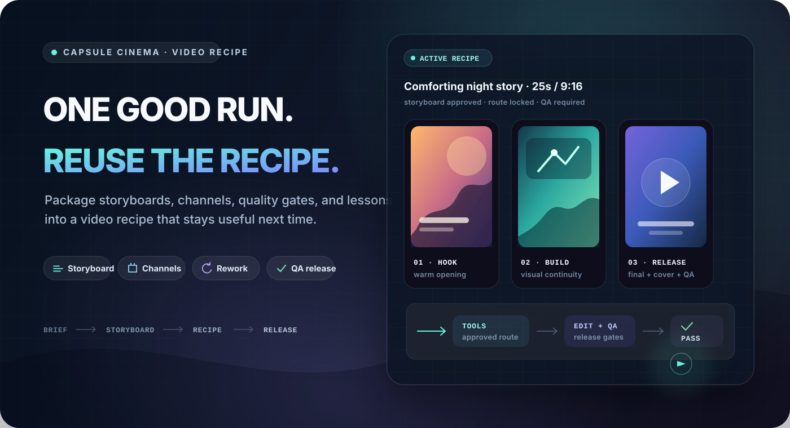
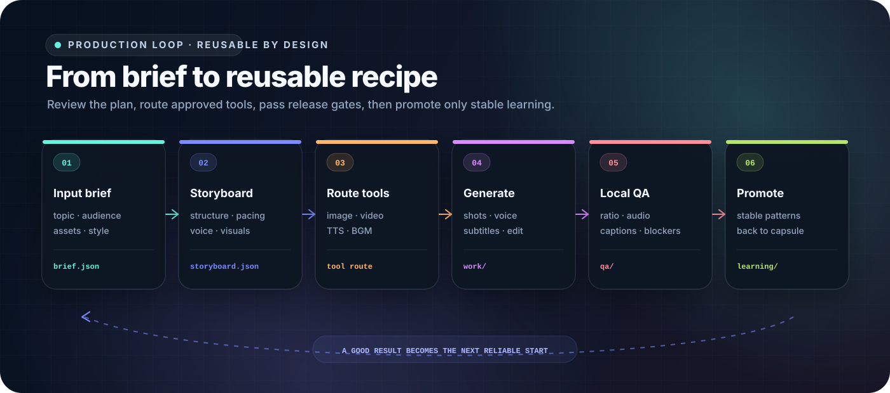

<div align="center">

# Capsule Cinema

**Turn one proven workflow into a short-video production system of your own.**

Capsule Cinema is a short-video production system that runs inside coding agents. It packages format structure, storyboard rules, provider requirements, quality gates, and rework lessons into portable video recipes. For the next episode, change the topic and assets instead of rebuilding the workflow.

<p>
  <a href="./README.md">中文</a> ·
  <a href="./LICENSE"></a>
  
  
  
  
</p>

<p>
  <strong>Reviewable storyboards · provider choice · scene-level rework · release QA · portable recipes</strong>
</p>

<p>
  <a href="#why-video-recipes">Why recipes</a> ·
  <a href="#demo">Demo</a> ·
  <a href="#quick-start">Quick Start</a> ·
  <a href="#included-video-recipes">Included recipes</a> ·
  <a href="#quality-gates-and-targeted-rework">Quality and rework</a> ·
  <a href="#bring-your-own-generation-providers">Providers</a> ·
  <a href="#community">Community</a>
</p>



</div>

Capsule Cinema is for creators and teams that publish recurring formats or product videos. Its starter recipes focus on Chinese short-video formats such as Douyin-style stories, product recommendations, and history explainers.

This project is not a browser-based one-click generator, and it does not provide model compute. It runs in the user's agent and local workspace. Media generation uses APIs configured by the user. The public provider examples currently center on Seedream, Seedance, MiniMax, Doubao Speech, and local FFmpeg.

## Why video recipes

A one-off prompt can produce a video, but it rarely gives the next episode a dependable starting point. A video recipe stores the parts of a format that have already worked, so a new topic can reuse the same production method.

| Common one-off workflow | Capsule Cinema |
| --- | --- |
| Explain the format again for every video | Reuse approved shot structure, pacing, and visual rules |
| Commit to generation before the direction is clear | Review the storyboard, then test one representative scene |
| Rebuild the full video when one scene fails | Rework one scene, voice track, subtitle pass, BGM track, or assembly |
| Treat any playable MP4 as finished | Check aspect ratio, black frames, loudness, subtitles, safe areas, and deliverables |
| Pick an improvised fallback when a tool is missing | Show available routes and pause when a change affects the promised result |
| Leave successful decisions in chat history | Write stable lessons back to the recipe after validation |
| Keep the workflow on one machine | Pack the recipe and install it in another machine or team environment |



A video recipe stores the reusable production method and can be packed for another machine. A recipe typically contains:

```text
video recipe
= inputs and usage boundaries
+ storyboard, visual, and audio recipes
+ tool capability requirements
+ quality gates and release checks
+ validated rework lessons
```

## Demo

These samples come from starter recipes included in the public repository. Keep the proven structure and quality rules, then replace the topic, assets, product, or episode copy.

<table>
  <tbody>
    <tr>
      <td width="62%" valign="top">
        <video width="100%" controls src="https://github.com/user-attachments/assets/d81e88b3-a567-4835-9784-c2a65f4fe977"></video>
      </td>
      <td width="38%" valign="top">
        <strong>Life-simulation story</strong>
        <br>
        Recipe: <code>life_sim</code>
        <br><br>
        Built for relatable work-and-life stories, anime narration, and recurring story formats.
        <br><br>
        The recipe stores second-person narration, hook structure, emotional progression, character consistency, shot pacing, and TTS rules.
      </td>
    </tr>
  </tbody>
</table>

<table width="100%">
  <tbody>
    <tr>
      <td width="50%" valign="top" align="center">
        <video width="260" controls src="https://github.com/user-attachments/assets/c7722195-0c14-4478-aeb8-b5e950518669"></video>
        <br>
        <strong>Commerce product showcase</strong>
        <br>
        Recipe: <code>ecommerce_product_showcase</code>
        <br>
        Product identity, selling-point order, scene demonstration, narration pacing, and compliance rules.
      </td>
      <td width="50%" valign="top" align="center">
        <video width="260" controls src="https://github.com/user-attachments/assets/5fff44fe-97e5-41e4-a966-2c8565926d89"></video>
        <br>
        <strong>Art image motion</strong>
        <br>
        Recipe: <code>art_motion</code>
        <br>
        Reference frames, style constraints, motion direction, and image-to-video checks.
      </td>
    </tr>
    <tr>
      <td width="50%" valign="top" align="center">
        <video width="260" controls src="https://github.com/user-attachments/assets/b5c672be-cacb-4877-a688-e6d7baa1a3b5"></video>
        <br>
        <strong>Chinese history explainer</strong>
        <br>
        Recipe: <code>guofeng_history</code>
        <br>
        Guofeng visuals, historical narration, voiceover pacing, and content boundaries.
      </td>
      <td width="50%" valign="top" align="center">
        <video width="260" controls src="https://github.com/user-attachments/assets/59f4c71c-9634-4b9f-8b48-e47f7a7c1d5f"></video>
        <br>
        <strong>Wool-felt ASMR craft</strong>
        <br>
        Recipe: <code>felt_asmr</code>
        <br>
        Material close-ups, making steps, calm pacing, and ASMR sound rules.
      </td>
    </tr>
  </tbody>
</table>

The public samples mainly use Volcengine Ark Seedream and Seedance, with MiniMax or Doubao Speech for narration. RunningHub action-transfer and lip-sync workflows remain available as code examples. Provider access, model permissions, and billing come from the user's own accounts.

## Quick Start

You do not need to memorize commands. Tell the agent what to install, make, repair, or save.

### 1. Ask the agent to install it

Clients that support Agent Skills can install the standard entry directly:

```bash
npx skills add JuneYaooo/capsule-cinema --skill capsule-cinema
```

The standard skill locates or downloads the Capsule Cinema runtime on first use. To check Python and FFmpeg and prepare dependencies during installation, send this to Codex, Claude Code, OpenClaw, Cursor, Trae, Hermes Agent, or another agent that can read files, run commands, and discover Skills:

```text
Install Capsule Cinema for me:
https://raw.githubusercontent.com/JuneYaooo/capsule-cinema/main/docs/install.md
```

Once installation finishes, tell the agent what you want to make. The standard distribution entry is `skills/capsule-cinema/SKILL.md`; see the [installation guide](docs/install.md) for details.

### 2. Review the storyboard and one representative scene

```text
Use Capsule Cinema to make a warm 25-second vertical video
about an orange cat running a late-night street-food stand.
Show me the storyboard first. After I approve it, make only one representative scene.
```

After the storyboard and representative scene look right, ask the agent to complete the video. Each run gets its own `output/<run>/` directory. `release/` contains deliverables, `work/` contains intermediate media and the edit plan, and `qa/` contains checks and repair recommendations.

Image, video, and speech generation require the matching providers. Browsing, validating, packing, and installing recipes do not call media-generation APIs. Never paste credentials into chat, recipes, prompts, scripts, or Git.

### 3. Save a successful method as a recipe

```text
I like this video. Save it as a "Comforting Night Stand" recipe
so I can keep making similar videos.
```

The recipe keeps reusable production methods, not episode facts, temporary assets, or credentials.

You can also draft a recipe from a reference video. The agent first breaks down its hook, shot rhythm, copy structure, visuals, motion, and sound, then separates sample-specific content from reusable methods:

```text
Use this local reference video to draft a reusable video recipe.
Tell me what methods you plan to keep before writing them into the recipe.
```

### 4. Reuse, update, or share it

```text
Use the "Comforting Night Stand" recipe for a rainy-night story
about a dog selling oden.
```

```text
The product close-up worked better at about two seconds.
Check whether that lesson belongs in the commerce recipe.
```

```text
Pack the "Comforting Night Stand" recipe so I can install it on another machine.
```

## Included video recipes

The repository includes the following recipes. You can inspect their contracts and customize them before running:

| Recipe | Best for | What it keeps stable |
| --- | --- | --- |
| `life_sim` | Second-person life simulations and anime story narration | Hooks, emotional progression, character rules, and fast pacing |
| `ecommerce_product_showcase` | Product demonstrations and commerce shorts | Product identity, selling-point structure, platform tone, and compliance |
| `art_motion` | Illustration, poster, and reference-frame motion | Style, motion direction, transitions, and reference constraints |
| `felt_asmr` | Wool-felt crafts and calming ASMR | Material detail, making steps, close-ups, sound, and pacing |
| `guofeng_history` | Chinese history and culture explainers | Guofeng visuals, character narrative, voiceover, and content boundaries |

## Quality gates and targeted rework

Capsule Cinema tracks playable output and release-ready output separately. After media generation, it builds an edit plan and checks local files, timeline structure, and release requirements.

| Area | Example checks |
| --- | --- |
| Video file | Aspect ratio, duration, codec, black frames, frozen frames, and audio tracks |
| Audio | Loudness, clipping, silence, and TTS duration against the scene |
| Frames and subtitles | Subtitle layout, safe areas, readability, character identity, and style consistency |
| Recipe contract | Required scenes, deliverables, forbidden fallbacks, and release gates |
| Delivery package | Final video, cover, and platform copy |

When a check fails, rework can target one scene, voice track, subtitle pass, BGM track, or assembly:

```text
The character is distorted in scene 3.
Regenerate only that scene and keep the other scenes and audio unchanged.
```

The repaired video goes through QA again. Blocking issues keep it out of the delivery state.

## What a video recipe stores

A recipe stores its use cases, input requirements, storyboard structure, visual style, audio strategy, capability needs, quality rules, and validated lessons. It does not store a complete previous video or copy facts, scripts, and temporary assets into the next episode.

Recipes come from three sources:

| Source | Use |
| --- | --- |
| Included recipes | Start from examples shipped in the repository |
| Personal recipes | Distill successful work into account, brand, or project methods |
| Shareable recipes | Pack a recipe for another machine, teammate, or community user |

Credentials, client data, and one-off run artifacts stay out of shareable recipes.

## Bring your own generation providers

Video recipes declare capability requirements without binding themselves to one vendor. At runtime, Capsule Cinema matches those requirements against image, video, TTS, music, digital-human, action-transfer, editing, and QA tools that are configured and approved on the current machine.

| Capability | Public example |
| --- | --- |
| Image generation | Volcengine Ark Seedream |
| Video generation | Volcengine Ark Seedance |
| Speech synthesis | Doubao Speech and MiniMax |
| Action transfer and lip sync | RunningHub |
| Editing, subtitles, and QA | Local FFmpeg and quality checks |

If a tool is unavailable, the runtime explains the available alternatives. It pauses for confirmation when a replacement changes the promised result instead of silently lowering quality.

## Community

Use [GitHub Issues](https://github.com/JuneYaooo/capsule-cinema/issues) to share recipe ideas, run problems, sample videos, or improvements.

Chinese developer community: [LINUX DO](https://linux.do/)

WeChat group: discuss video production and share video recipes. Scan the QR code to join the capsule-cinema community.

<p align="left">
  
</p>

## License

This project uses the PolyForm Noncommercial License 1.0.0. Read the full [LICENSE](./LICENSE) before commercial use.
