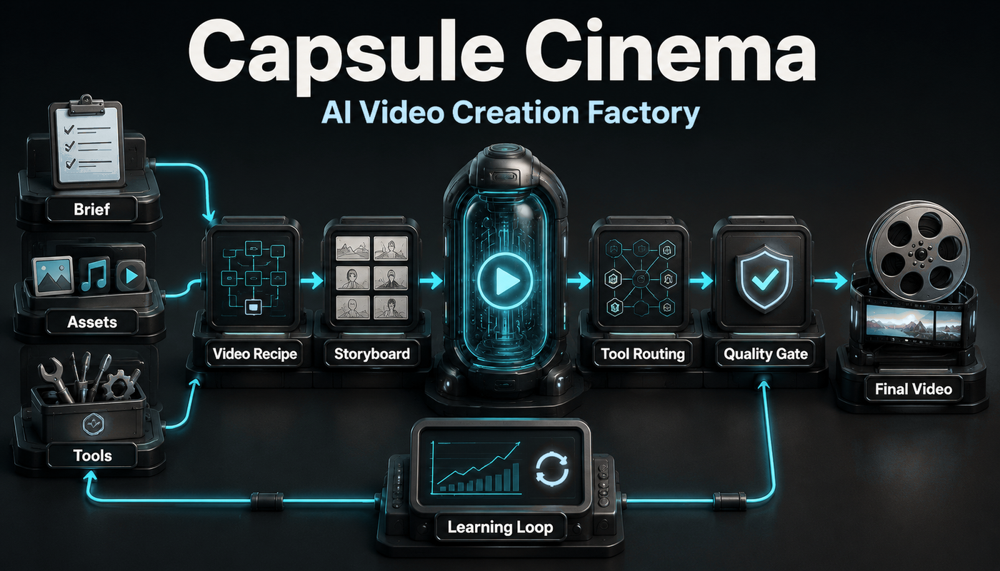
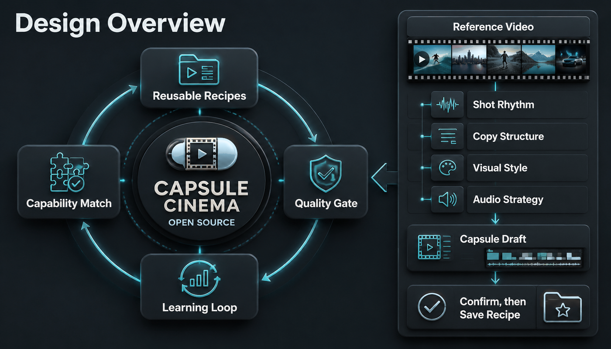
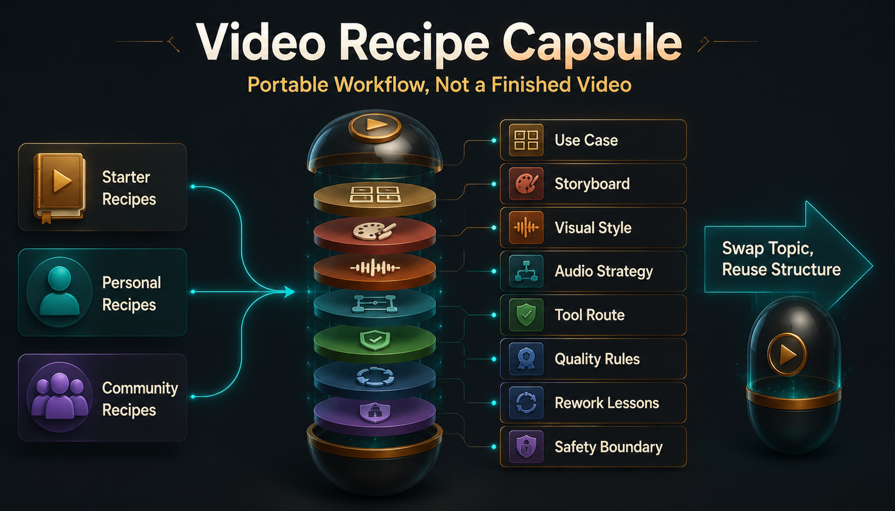
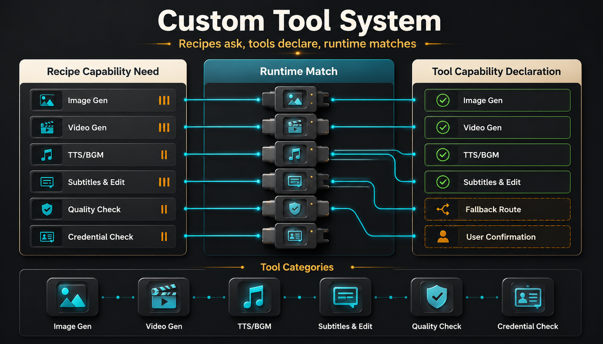

# Capsule Cinema

**Turn a working AI video process into a reusable video recipe.**

Capsule Cinema is for creators and teams who make video repeatedly. Describe the goal, material, and style; it turns the request into storyboards, routes image, video, voice, music, subtitle, editing, and QA tools, then writes useful lessons back into the recipe.

  <a href="./README.md">中文</a> ·
  
  
  
  

  <a href="#what-it-does">What it does</a> ·
  <a href="#video-capability-map">Capability map</a> ·
  <a href="#demo">Demo</a> ·
  <a href="#design">Design</a> ·
  <a href="#video-recipes">Video recipes</a> ·
  <a href="#custom-tools">Custom tools</a> ·
  <a href="#quick-start">Quick Start</a> ·
  <a href="#community">Community</a>

Capsule Cinema is not just another one-shot video generator. It saves how a class of videos works: how briefs become storyboards, how style is defined, how tools are selected, how quality is checked, and which lessons should carry into the next run.

## What it does

| What you need | How Capsule Cinema helps |
| --- | --- |
| Start from a short brief | Turns audience, topic, style, and assets into a storyboard, media plan, audio plan, edit, and QA flow |
| Review before generation | Lets you create only the storyboard first, then continue after approval |
| Rework one part | Regenerates one shot, swaps BGM, or re-edits existing assets without restarting the whole video |
| Make a repeatable format | Saves the working structure, rhythm, style, and quality rules as a video recipe |
| Learn from a reference video | Analyzes shot rhythm, copy structure, visual style, and audio strategy, then creates a capsule draft for approval |
| Use your own tools | Matches recipe needs with your image, video, TTS, BGM, subtitle, editing, and QA tools |
| Check release readiness | Produces local QA, quality scores, repair suggestions, and release checkpoints |

## Video capability map

Capsule Cinema treats video tools as capability layers, not as a fixed provider chain. Image generation, AI video, TTS, AI music, digital humans, action imitation, source-footage editing, subtitles, QA, and release checks can all be routed through the same recipe system.

## Demo

These samples come from starter recipes included in the project. They show how recipes organize structure, style, audio, and quality rules.

<table>
  <tbody>
    <tr>
      <td width="62%" valign="top">
        <video width="100%" controls src="https://github.com/user-attachments/assets/d81e88b3-a567-4835-9784-c2a65f4fe977"></video>
      </td>
      <td width="38%" valign="top">
        <strong><code>life_sim</code></strong>
         
        Life-simulation storytelling for workplace, everyday drama, and animated empathy clips. Best for hook-driven openings, fast scene changes, and narrative progression.
      </td>
    </tr>
  </tbody>
</table>

<table width="100%">
  <tbody>
    <tr>
      <td width="50%" valign="top" align="center">
        <video width="260" controls src="https://github.com/user-attachments/assets/c7722195-0c14-4478-aeb8-b5e950518669"></video>
         
        <strong><code>ecommerce_product_showcase</code></strong>
         
        Product showcase and short-form commerce videos.
      </td>
      <td width="50%" valign="top" align="center">
        <video width="260" controls src="https://github.com/user-attachments/assets/5fff44fe-97e5-41e4-a966-2c8565926d89"></video>
         
        <strong><code>art_motion</code></strong>
         
        Motion clips from art images and start/end frames.
      </td>
    </tr>
    <tr>
      <td width="50%" valign="top" align="center">
        <video width="260" controls src="https://github.com/user-attachments/assets/b5c672be-cacb-4877-a688-e6d7baa1a3b5"></video>
         
        <strong><code>guofeng_history</code></strong>
         
        Chinese historical and cultural explainers.
      </td>
      <td width="50%" valign="top" align="center">
        <video width="260" controls src="https://github.com/user-attachments/assets/59f4c71c-9634-4b9f-8b48-e47f7a7c1d5f"></video>
         
        <strong><code>felt_asmr</code></strong>
         
        Felt craft baking ASMR and soft handmade food videos.
      </td>
    </tr>
  </tbody>
</table>

## Design

Capsule Cinema treats video production as a loop. It creates reviewable storyboards, routes tools to produce media, checks quality, supports local rework, and saves the useful parts back into the recipe.

Reference videos stay inside that boundary. The system analyzes shot rhythm, copy structure, visual style, and audio strategy, then creates a capsule draft. The draft is written into a recipe only after approval.

## Video recipes

A Capsule is a portable video workflow, not a finished video. It stores the reusable parts of a format: use case, storyboard structure, visual style, audio strategy, tool route, quality rules, rework lessons, and safety boundary.

Recipes can come from three places:

- Starter recipes: seed examples included in the project.
- Personal recipes: formats you distilled from your own successful work.
- Community recipes: shareable methods that others can try, adapt, and improve.

When you reuse a recipe, you swap the topic, assets, and episode copy while keeping the proven structure. A recipe should not store API keys, cookies, client data, private assets, temporary links, or one-off run outputs.

## Custom tools

AI video tools change quickly, so recipes do not bind themselves to one vendor. A recipe describes the capability it needs, each tool declares what it can do, and the runtime matches them.

You can connect tools for:

| Tool type | Uses |
| --- | --- |
| Image generation | Text-to-image, image-to-image, style transfer, cover images |
| Video generation | Text-to-video, image-to-video, start/end-frame video, action transfer, lip sync |
| Audio generation | TTS, voices, BGM, sound effects, music generation |
| Post production | Subtitles, concatenation, transcoding, covers, intros and outros |
| Quality checks | Black frames, aspect ratio, subtitle occlusion, loudness, release checks |

Before a run, Capsule Cinema checks credentials and matches capabilities. If a tool is unavailable, it can list fallback routes; downgrades that need user approval pause first.

## Quick Start

After installing Capsule Cinema, describe the video you want:

> Use Capsule Cinema to make a 30-second vertical video about `<topic>` for `<audience>` in `<style>`.

Useful prompts:

| Goal | Say this |
| --- | --- |
| Storyboard first | “Only create the storyboard for now. Do not generate images, video, or voice yet. The topic is `<topic>`.” |
| Full video | “Use Capsule Cinema to make a `<duration>` second `<landscape/vertical>` video about `<topic>`, focusing on `<value point>`.” |
| Rework one shot | “I do not like scene `<number>` from the last video. Keep everything else and regenerate only that scene: `<change request>`.” |
| Reuse assets | “These scene assets are good. Re-edit them with the new subtitle, BGM, and pacing requirements.” |
| Check release readiness | “Check whether this video is publishable. Focus on visuals, audio, subtitles, duration, language match, and recipe quality rules.” |
| Save as a recipe | “I am happy with this video. Save it as `<recipe name>` for future `<use case>` videos.” |
| Analyze a reference video | “Analyze this local reference video `<video path>`, extract reusable structure, style, pacing, copy, and quality rules, then create a capsule draft called `<recipe name>`.” |
| Add a tool channel | “Add a new `<tool/channel name>`. Here is the API documentation: `<paste docs>`. Connect it to Capsule Cinema and include a simple user example.” |

If you are not sure which recipe to use, say:

> Review Capsule Cinema's starter recipes, recommend one for my goal, and tell me what assets you still need from me.

## Community

Use [GitHub Issues](https://github.com/JuneYaooo/capsule-cinema/issues) to share recipe ideas, run problems, sample videos, or improvement requests.

Chinese developer community: [LINUX DO](https://linux.do/)

## License

PolyForm Noncommercial License 1.0.0. See [LICENSE](./LICENSE).
