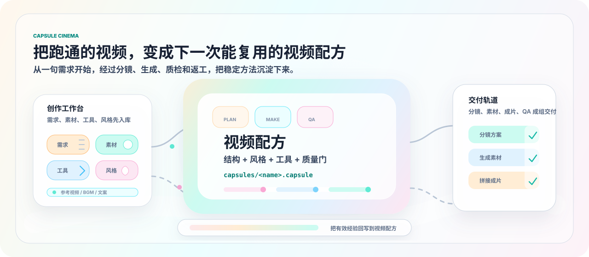

# Capsule Cinema 胶囊影厂

**AI 视频创作工厂，把跑通的视频沉淀成可复用的视频配方。**

面向持续做内容的人和团队：从一句需求开始，完成分镜、画面、视频、配音、BGM、字幕、拼接、质量检查和经验沉淀。你可以使用内置配方，也可以接入自己的工具，做出适合自己账号、品牌或项目的稳定视频流水线。

  
  
  
  

  <a href="#demo">Demo</a> &nbsp;·&nbsp;
  <a href="#quick-start">Quick Start</a> &nbsp;·&nbsp;
  <a href="#recipes">视频配方</a> &nbsp;·&nbsp;
  <a href="#custom-tools">自定义工具</a> &nbsp;·&nbsp;
  <a href="#why">为什么做这个</a> &nbsp;·&nbsp;
  <a href="#community">社群</a>

你可以把胶囊理解成打包好的视频配方。它保存的不是某条成片，而是一类视频可复用的做法：怎么接需求、怎么写分镜、怎么定风格、怎么配音和剪辑、怎么检查质量，以及哪些坑不要再踩。

Capsule Cinema 的重点不是“再生成一条视频”。它更像一个小型创作工厂：把选题、素材、工具、风格、质量标准和返工经验放进同一条流程里，下次换主题、换素材，还能继续复用。

## Demo 和初始配方

Capsule Cinema 内置了一批初始视频配方，覆盖电商商品、艺术动态短片、治愈 ASMR、剧情口播、国风讲解等常见视频场景。它们不是为了覆盖所有需求，而是作为种子案例，告诉你一套视频配方应该怎么组织。

每个 Demo 都标注了配方短名；运行时只接受这些短名。横屏和竖屏分开摆放，避免不同画幅混在一排里挤变形。

### 横屏 Demo

<table>
  <tbody>
    <tr>
      <td width="62%" valign="top">
        <video width="100%" controls src="https://github.com/user-attachments/assets/5587bea5-7ec3-4884-9dce-753401cd6dd7"></video>
      </td>
      <td width="38%" valign="top">
        <strong><code>life_sim</code></strong>
         
        人生模拟、打工人剧情口播、动漫生活共情短片。适合有开场钩子、多场景快切和剧情推进的账号。
      </td>
    </tr>
  </tbody>
</table>

### 竖屏 Demo

<table width="100%">
  <tbody>
    <tr>
      <td width="50%" valign="top" align="center">
        <video width="260" controls src="https://github.com/user-attachments/assets/91585bb5-3edd-4b3b-b831-67cbf33f2559"></video>
         
        <strong><code>ecommerce_product_showcase</code></strong>
         
        电商商品展示和种草短视频。
      </td>
      <td width="50%" valign="top" align="center">
        <video width="260" controls src="https://github.com/user-attachments/assets/5fff44fe-97e5-41e4-a966-2c8565926d89"></video>
         
        <strong><code>art_motion</code></strong>
         
        艺术图像首尾帧动态短片。
      </td>
    </tr>
    <tr>
      <td width="50%" valign="top" align="center">
        <video width="260" controls src="https://github.com/user-attachments/assets/d9d0c38d-10c2-4643-95a3-fdb417d33e32"></video>
         
        <strong><code>felt_asmr</code></strong>
         
        羊毛毡烘焙 ASMR 和毛绒食物手作。
      </td>
      <td width="50%" valign="top" align="center">
        <video width="260" controls src="https://github.com/user-attachments/assets/b5c672be-cacb-4877-a688-e6d7baa1a3b5"></video>
         
        <strong><code>guofeng_history</code></strong>
         
        国风历史文化讲解。
      </td>
    </tr>
  </tbody>
</table>

表格只列 `run_video.py --capsule <短名>` 可直接读取的 active `capsules/<短名>.capsule/`。动作迁移、数字人口播/对口型、角色 MV 属于专用能力路线；若使用归档 zip 或其他旧固定配方，先从 `archive/legacy_capsule_zips/` 导入/安装到本地胶囊库，或按包内 `local_script` 入口运行，再点名对应短名。

## Quick Start

安装 Capsule Cinema 后，直接在对话里说目标即可：

> 用 Capsule Cinema 做一个 30 秒竖屏短视频，主题是 `<主题>`，目标观众是 `<人群>`，风格要 `<风格>`。

更可控的说法：

| 想做什么 | 对 AI 这样说 |
|----------|--------------|
| 先看方案 | “先只生成分镜，不要生成图片、视频和配音。主题是 `<主题>`，我确认后再继续制作。” |
| 做完整成片 | “用 Capsule Cinema 做一个 `<时长>` 秒 `<横屏/竖屏>` 视频，主题是 `<主题>`，重点突出 `<价值点>`。” |
| 改某个镜头 | “上一次视频第 `<编号>` 个分镜不满意，请保留其他部分，只重做这个分镜：`<修改要求>`。” |
| 复用已有素材 | “这些分镜素材已经可以了，请重新拼接，并按新的字幕/BGM/节奏要求调整最终成片。” |
| 检查能不能发 | “请检查这个成片是否可发布，重点看画面、声音、字幕、时长、语言匹配和配方质检规则。” |
| 保存成配方 | “这条视频我满意，请保存成 `<配方名>`，适合以后做 `<适用场景>`。” |

如果不确定怎么选，直接说：

> 请先查看 Capsule Cinema 的初始视频配方，根据我的目标推荐一个配方，并说明还需要我补哪些素材。

## 能做什么

| 你关心的事 | Capsule Cinema 怎么处理 |
|------------|--------------------------|
| 我只想说需求，不想研究工具链 | 用自然语言说明主题、人群、风格和素材，AI 会路由到分镜、生成、拼接或配方流程 |
| 我怕一次生成不满意 | 可以先只看分镜，也可以只重做某个分镜、只换 BGM、只重拼已有素材 |
| 我想稳定做同一类视频 | 把满意作品保存成视频配方，沉淀结构、风格、节奏、资产和质量规则 |
| 我想持续做内容 | 把选题、脚本、资产、返工记录和发布检查放进同一条流程，减少每条视频从零开始 |
| 我关心能不能发布 | 成片后生成本地 QA 报告、质量评分、修复计划和发布检查点 |
| 我有自己的工具 | 把自定义图像、视频、TTS、BGM、字幕、剪辑或质检工具接入能力库，让配方按能力选择工具 |

## 支持用户自定义工具

工具不应该绑死在某一个平台。AI 视频工具更新太快，今天好用的模型，明天可能降级、限流、涨价或换接口。Capsule Cinema 的设计是：配方描述“需要什么能力”，工具声明“我能提供什么能力”，运行时负责把两者对上。

你可以接入自己的工具或渠道：

| 工具类型 | 可以接入什么 |
|----------|--------------|
| 图像生成 | 自有图片模型、第三方文生图/图生图 API、内部风格化服务 |
| 视频生成 | 文生视频、图生视频、首尾帧视频、动作迁移、对口型、数字人渠道 |
| 音频生成 | TTS、音色库、BGM、音效、音乐生成服务 |
| 后期处理 | 字幕、拼接、转码、封面、片头片尾、品牌水印 |
| 质量检查 | 黑屏检测、画幅检测、字幕遮挡、声音响度、发布前检查 |

常用说法：

- “帮我新增一个 `<工具/渠道名>`，接口文档如下：`<粘贴文档>`。请注册完整流程、补测试，并写一个简单用户示例。”
- “这个工具以后用户可以这样说：`<一句用户示例>`。请按这个交互方式同步文档。”
- “我想让 `<配方名>` 优先使用这个工具。如果不可用，请列出可替代工具，不要静默降级。”

实现上，自定义工具会进入能力层和注册层：`lib/config/tool_capabilities.yaml` 描述工具能做什么、需要什么凭证和成本层级；`lib/config/tool_registry.yaml` 管理运行时调用入口。配方运行前会做 preflight，发现缺失能力、替代工具和需要用户确认的降级。工具能力抽象层见 [`docs/capsule-tool-abstraction-design.md`](docs/capsule-tool-abstraction-design.md)。

## 视频配方体系设计

在 Capsule Cinema 里，视频配方会被保存成一个 Capsule，也就是“胶囊”。它是一个可迁移的视频工作流包，会把一类视频里真正能复用的东西拆开保存：怎么接需求、怎么写分镜、怎么定风格、怎么配音和剪辑、怎么判断能不能发布，以及哪些坑不要再踩。

一个视频配方包通常包含这些部分：

| 部分 | 作用 |
|------|------|
| `capsule.yaml` | 配方身份、适用场景、能力标签、执行模式和阶段读取顺序 |
| `CARD.md` / `index.md` | 给人和 agent 看的入口，说明这个配方适合什么、不适合什么 |
| `contracts/` | 输入要求和运行约束，例如必须提供哪些素材、默认画幅、时长、工具路线 |
| `recipes/` | 可复用创作方法，分成结构、视觉、文案、音频、运动和剪辑节奏 |
| `quality/` | 质量规则和发布门槛，防止黑屏、错画幅、字幕问题、风格漂移、工具降级 |
| `assets/` | 可复用或仅作参考的固定素材，例如 BGM、音效、片头、风格参考 |
| `learning/` | 从真实运行和返工里提炼出的通用经验，避免把原始项目资料直接塞进配方包 |

这套设计支持三种层级：项目内置的初始配方用来快速上手；个人配方用来沉淀自己的创作经验；社区配方则可以通过 Issue 或社群分享出来，让更多人一起试、改、复用。

## 把好作品变成配方

当一条视频已经跑通、风格满意、后续还想继续做同类内容时，让 AI 保存成视频配方即可。AI 会从成片、分镜、提示词、素材、BGM、QA 报告和修改反馈里提炼可复用部分。

常用说法：

- “这条视频我满意。请把这次工作流保存成一个新视频配方，名字叫 `<配方名>`。”
- “这次是在 `<已有配方名>` 基础上做出来的，请把更好的改动沉淀回这个配方。”
- “请保存成配方，但不要保存客户资料、私密文件、一次性链接、账号信息或任何密钥。”
- “请把这个配方整理成可分享版本，先检查敏感信息和不可分发素材。”

视频配方只保留可复用的不变量，不保留某一次运行的具体产物：

| 类型 | 怎么处理 |
|------|----------|
| 保留 | 目标人群、适用/不适用场景、默认画幅和时长、分镜结构、固定开场、视觉风格、音频策略、质量规则、已知坑和修复方法 |
| 每期重做 | 主题、具体内容、当期文案、当期角色/场景图 |
| 只当示例 | 某一期用过的文案、提示词、镜头组织方式；标注为示例，不直接照搬 |
| 不保留 | 成片、运行产物绝对路径、客户资料、临时链接、密钥、cookie、私有接口、不可授权素材 |

固定素材分两种语义：`reuse=always` 表示每期必用，例如固定 BGM；`reference_only` 表示只作风格参考，每期重做。这条边界由 `doctor` 自动校验。完整数据结构、角色枚举与校验规则见 [`references/local-capsule-sqlite.md`](references/local-capsule-sqlite.md)。

## 为什么做这个

AI 视频最容易卡在一个地方：看起来能生成，但很难稳定交付。一次性生成适合试灵感，不适合复用经验。镜头漂了、节奏错了、字幕挡脸、BGM 盖人声、工具偷偷降级，这些问题往往发生在链路中间。

Capsule Cinema 的判断是：创作者未来的核心资产不是一堆提示词，而是能反复工作的视频配方。配方不是模板，而是可以复用的创作经验。一个好配方应该知道适合什么场景、怎么开头、用什么风格、哪些资产可复用、哪些质量问题必须拦下，以及上次踩过哪些坑。

所以这个项目把视频拆成工作流：先分镜，再生成，再返工，再拼接，再 QA，最后把有效经验沉淀回配方。工具会变，模型会变，但经过验证的结构、审美和质量标准应该留下来。

## 分享你的配方

项目里内置了一些初始视频配方，但更有意思的是每个人都可以创作自己的配方。如果你跑通了一类视频，比如产品种草、剧情口播、知识科普、ASMR、国风短片、课程切片或品牌创意短片，就可以把这套经验沉淀下来。下次换主题、换素材，不用从零开始。

如果你做出了好用的视频配方，欢迎通过 GitHub Issue 或社群分享。社群会重点交流这些内容：

- 好用的配方怎么设计，哪些结构、风格、节奏更容易稳定出片。
- 不同视频类型的分镜、文案、视觉、音频和剪辑策略。
- AI 视频生成工具的真实效果、适用场景和常见坑。
- 如何把一次成功作品沉淀成可复用工作流。
- 配方运行失败、质量不过关、工具降级时怎么修。
- 社区成员分享的配方、成片案例、创作需求和共创想法。

分享配方前，请确认里面不包含 API key、cookie、客户资料、私有素材、未授权音乐/字体/图片、一次性链接或不可公开的运行产物。视频配方应该沉淀可复用方法，不要打包某一次项目的私有内容。

## 致谢

感谢所有愿意试用、反馈、提 issue、分享配方和踩坑记录的朋友。Capsule Cinema 的很多判断来自真实视频生产里的失败和返工：哪些流程能复用，哪些问题必须拦下，哪些经验值得沉淀成视频配方。

也感谢后续愿意参与共创的贡献者。无论是提交配方想法、补充视频案例、改进文档、修复工具链问题，还是把一类视频的经验整理成可复用配方，都会让这个项目变得更有用。

## 社群

欢迎通过 [GitHub Issues](https://github.com/JuneYaooo/capsule-cinema/issues) 分享配方想法、运行问题、成片案例或改进建议。

也欢迎在社群里交流：

- 你做出来的视频配方和成片案例。
- 不同视频类型的结构、节奏、视觉和音频策略。
- AI 视频工具的真实效果、适用边界和坑。
- 如何把一次成功作品沉淀成可复用工作流。
- 想共创或希望项目支持的新视频场景。

中文开发者社区：[LINUX DO](https://linux.do/)

## License

PolyForm Noncommercial License 1.0.0，详见 [LICENSE](./LICENSE)。
