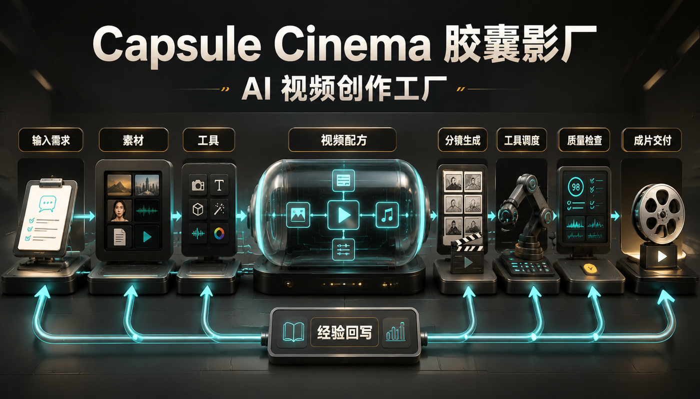
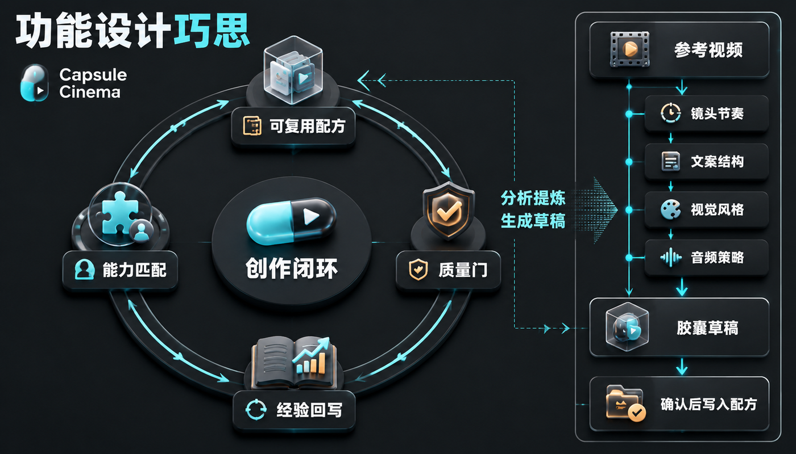
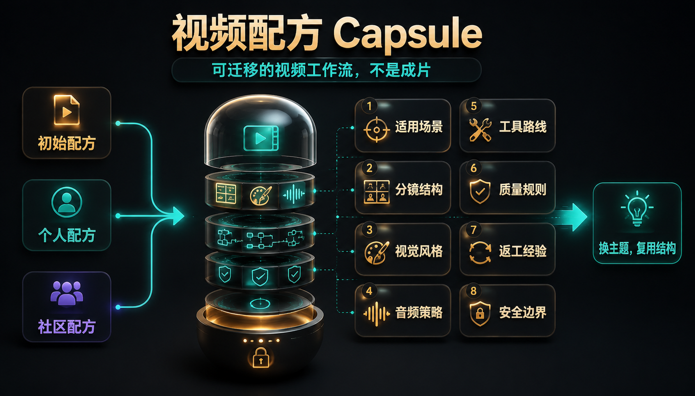
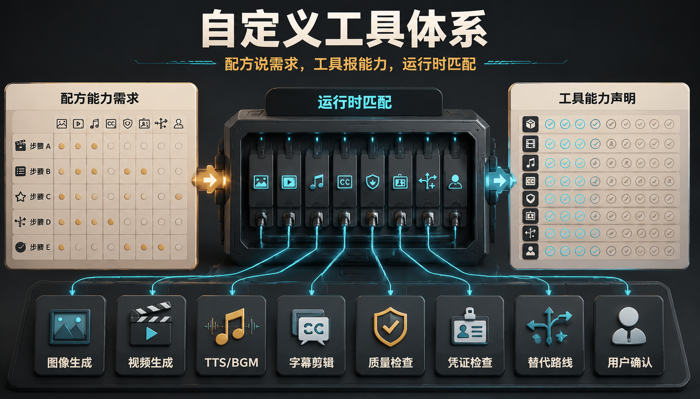

# Capsule Cinema 胶囊影厂

**把一次跑通的 AI 视频流程，沉淀成可复用的视频配方。**

面向持续做内容的人和团队。你说清目标、素材和风格，Capsule Cinema 负责把需求拆成分镜，调度图像、视频、配音、BGM、字幕、剪辑和质检工具，并把有效经验回写到配方里。

  <a href="./README.en.md">English</a> ·
  
  
  
  

  <a href="#能做什么">能做什么</a> ·
  <a href="#demo">Demo</a> ·
  <a href="#设计巧思">设计巧思</a> ·
  <a href="#视频配方">视频配方</a> ·
  <a href="#自定义工具">自定义工具</a> ·
  <a href="#quick-start">Quick Start</a> ·
  <a href="#社群">社群</a>

Capsule Cinema 的核心不是单次生成一条视频，而是把一类视频的做法保存下来：选题怎么接、分镜怎么拆、风格怎么定、工具怎么选、质量怎么拦、返工经验怎么复用。下次换主题或素材，保留已经验证过的结构。

## 能做什么

| 你想做的事 | Capsule Cinema 怎么帮你 |
| --- | --- |
| 从一句需求开始做视频 | 把主题、人群、风格和素材拆成分镜、画面、视频、音频和剪辑流程 |
| 先看方案再生成 | 可以只出分镜，确认后再继续生成图片、视频、配音和字幕 |
| 局部返工 | 只重做某个镜头、只换 BGM、只重拼已有素材，不必整条视频重来 |
| 稳定做同一类内容 | 把跑通的流程保存成视频配方，复用结构、节奏、风格和质检规则 |
| 学习参考视频 | 分析镜头节奏、文案结构、视觉风格和音频策略，先生成胶囊草稿，确认后再写入配方 |
| 接入自己的工具 | 让配方描述需要的能力，运行时匹配你自己的图像、视频、TTS、BGM、字幕、剪辑和质检工具 |
| 判断能不能发布 | 生成本地 QA、质量评分、修复建议和发布检查点 |

## Demo

这些样片来自项目内置的 starter recipes。它们是种子案例，用来展示配方如何组织结构、风格、音频和质量规则。

<table>
  <tbody>
    <tr>
      <td width="62%" valign="top">
        <video width="100%" controls src="https://github.com/user-attachments/assets/d81e88b3-a567-4835-9784-c2a65f4fe977"></video>
      </td>
      <td width="38%" valign="top">
        <strong><code>life_sim</code></strong>
         
        人生模拟、打工人剧情口播、动漫生活共情短片。适合开场钩子、多场景快切和剧情推进。
      </td>
    </tr>
  </tbody>
</table>

<table width="100%">
  <tbody>
    <tr>
      <td width="50%" valign="top" align="center">
        <video width="260" controls src="https://github.com/user-attachments/assets/c7722195-0c14-4478-aeb8-b5e950518669"></video>
         
        <strong><code>ecommerce_product_showcase</code></strong>
         
        电商商品展示和种草短视频。
      </td>
      <td width="50%" valign="top" align="center">
        <video width="260" controls src="https://github.com/user-attachments/assets/5fff44fe-97e5-41e4-a966-2c8565926d89"></video>
         
        <strong><code>art_motion</code></strong>
         
        艺术图像首尾帧动态短片。
      </td>
    </tr>
    <tr>
      <td width="50%" valign="top" align="center">
        <video width="260" controls src="https://github.com/user-attachments/assets/b5c672be-cacb-4877-a688-e6d7baa1a3b5"></video>
         
        <strong><code>guofeng_history</code></strong>
         
        国风历史文化讲解。
      </td>
      <td width="50%" valign="top" align="center">
        <video width="260" controls src="https://github.com/user-attachments/assets/59f4c71c-9634-4b9f-8b48-e47f7a7c1d5f"></video>
         
        <strong><code>felt_asmr</code></strong>
         
        羊毛毡烘焙 ASMR 和毛绒食物手作。
      </td>
    </tr>
  </tbody>
</table>

## 设计巧思

Capsule Cinema 把视频生产拆成闭环：先生成可审的分镜，再调度工具产出素材，接着做质量检查和局部返工，最后把稳定下来的做法写回配方。

参考视频也走同一条边界。系统会分析镜头节奏、文案结构、视觉风格和音频策略，生成胶囊草稿；草稿确认后才写入配方。参考视频不是每期照搬的素材。

## 视频配方

Capsule 不是成片，而是一套可迁移的视频工作流。它保存一类视频的不变量：适用场景、分镜结构、视觉风格、音频策略、工具路线、质量规则、返工经验和安全边界。

配方可以来自三类来源：

- 初始配方：项目内置的种子案例，用来快速上手。
- 个人配方：你从满意作品里沉淀出的账号、品牌或项目经验。
- 社区配方：可以分享、试用和改进的公共创作方法。

复用时只替换主题、素材和当期文案，保留已经验证过的结构。配方不应该保存密钥、cookie、客户资料、私有素材、临时链接或一次性运行产物。

## 自定义工具

AI 视频工具更新很快，所以配方不绑定某个平台。配方只说明需要什么能力，工具声明自己能提供什么能力，运行时负责匹配。

你可以接入这些工具：

| 工具类型 | 用途 |
| --- | --- |
| 图像生成 | 文生图、图生图、风格化、封面图 |
| 视频生成 | 文生视频、图生视频、首尾帧、动作迁移、对口型 |
| 音频生成 | TTS、音色库、BGM、音效、音乐生成 |
| 后期处理 | 字幕、拼接、转码、封面、片头片尾 |
| 质量检查 | 黑屏、画幅、字幕遮挡、声音响度、发布前检查 |

运行前会做凭证检查和能力匹配。工具不可用时，系统会列出替代路线；需要用户确认的降级不会静默执行。

## Quick Start

安装 Capsule Cinema 后，直接在对话里说目标即可：

> 用 Capsule Cinema 做一个 30 秒竖屏短视频，主题是 `<主题>`，目标观众是 `<人群>`，风格要 `<风格>`。

常用说法：

| 想做什么 | 对 AI 这样说 |
| --- | --- |
| 先看分镜 | “先只生成分镜，不要生成图片、视频和配音。主题是 `<主题>`，我确认后再继续制作。” |
| 做完整成片 | “用 Capsule Cinema 做一个 `<时长>` 秒 `<横屏/竖屏>` 视频，主题是 `<主题>`，重点突出 `<价值点>`。” |
| 局部返工 | “上一次视频第 `<编号>` 个分镜不满意，请保留其他部分，只重做这个分镜：`<修改要求>`。” |
| 复用已有素材 | “这些分镜素材已经可以了，请重新拼接，并按新的字幕、BGM 和节奏要求调整最终成片。” |
| 检查能不能发 | “请检查这个成片是否可发布，重点看画面、声音、字幕、时长、语言匹配和配方质检规则。” |
| 保存成配方 | “这条视频我满意，请保存成 `<配方名>`，适合以后做 `<适用场景>`。” |
| 分析参考视频 | “请分析这个本地参考视频 `<视频路径>`，拆出可复用的结构、风格、节奏、文案和质量规则，先生成 `<配方名>` 的胶囊草稿。” |
| 新增工具渠道 | “帮我新增一个 `<工具/渠道名>`，接口文档如下：`<粘贴文档>`。请把它接入 Capsule Cinema，并写一个简单用户示例。” |

不确定选哪个配方时，可以说：

> 请查看 Capsule Cinema 的初始视频配方，根据我的目标推荐一个，并说明还需要我补哪些素材。

## 社群

欢迎通过 [GitHub Issues](https://github.com/JuneYaooo/capsule-cinema/issues) 分享配方想法、运行问题、成片案例或改进建议。

中文开发者社区：[LINUX DO](https://linux.do/)

## License

PolyForm Noncommercial License 1.0.0，详见 [LICENSE](./LICENSE)。
