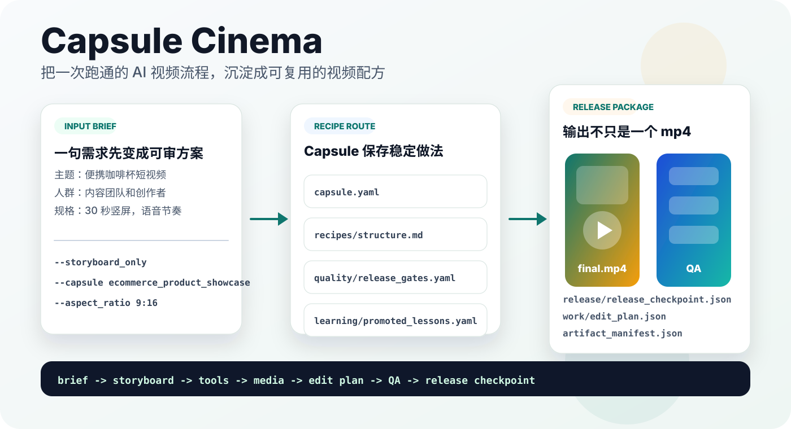
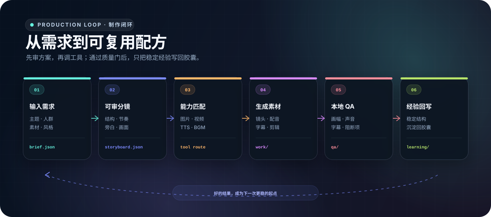
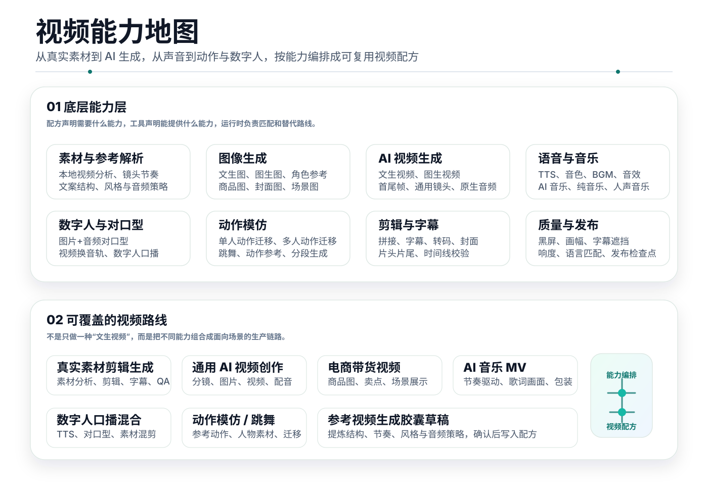
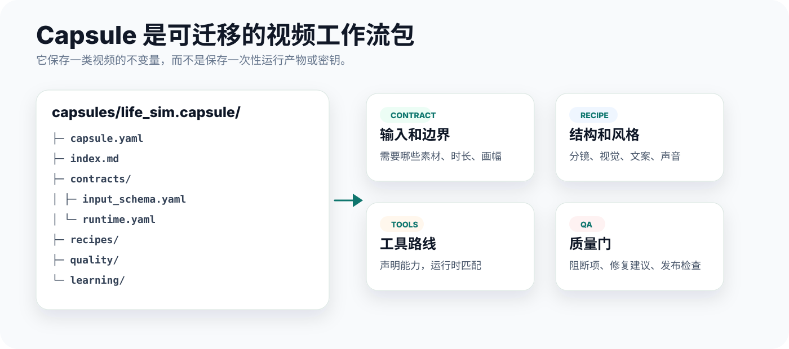

<div align="center">

# Capsule Cinema 视频配方工厂

**AI 视频创作工厂：把能跑通的视频流程，沉淀成可复用的创作配方。**

Capsule Cinema 面向持续做短视频的人和团队。它把需求、素材、工具能力和质量标准组织成一套可复用的视频配方，让同一类视频可以稳定复用结构，同时换主题、换素材、换风格。

<p>
  <a href="./README.en.md">English</a> ·
  <a href="./LICENSE"></a>
  
  
  
  
</p>

<p>
  <strong>这是一个 Skills 项目，支持 Codex、Claude Code、Hermes、WorkBuddy、OpenClaw、扣子等 Agent，简单安装配置后即可使用。</strong><br>
  安装到对应 Agent 环境后，AI Agent 会读取 <code>skill.md</code>、<code>references/</code>、视频配方目录和本地工具入口，按视频配方完成分镜、生成、剪辑、字幕、BGM 和质检。
</p>

<p>
  <a href="#demo">Demo</a> ·
  <a href="#为什么需要-capsule-cinema">为什么需要</a> ·
  <a href="#能做什么">能做什么</a> ·
  <a href="#视频能力地图">视频能力地图</a> ·
  <a href="#视频配方">视频配方</a> ·
  <a href="#自定义工具">自定义工具</a> ·
  <a href="#工作方式">工作方式</a> ·
  <a href="#quick-start">Quick Start</a> ·
  <a href="#社群">社群</a>
</p>



</div>

简单说，Capsule Cinema 是一个可安装的 AI Agent Skills 包，里面包含 agent 说明、视频生产运行时、能力匹配规则和一组可复用视频配方。你不是直接打开一个网页使用它，而是把它装进 Codex、Claude Code、Hermes、WorkBuddy、OpenClaw、扣子等支持 Skills 的 Agent 环境，再用对话驱动视频制作。

Capsule Cinema 不是一次性视频生成器。它更像一个可复用的视频生产系统：先把创作过程拆成分镜、工具路线、音频策略、质量规则和返工经验，再把这些稳定部分保存成配方。

它的创作闭环由配方体系、工具能力、质量门和经验回写组成：每次交付都留下可复用配方，同时把凭证、渠道和安全边界留在正确的本地层，方便复用下一期。

## Demo

这些样片来自内置起步配方，并且对应胶囊随公开仓库提供。公开执行路线使用火山方舟官方图片与 Seedance 视频渠道，配音可选官方 MiniMax 或豆包语音（API Key + 双向 WebSocket）；RunningHub 动作迁移和口型工作流以代码示例保留。

<table>
  <tbody>
    <tr>
      <td width="62%" valign="top">
        <video width="100%" controls src="https://github.com/user-attachments/assets/d81e88b3-a567-4835-9784-c2a65f4fe977"></video>
      </td>
      <td width="38%" valign="top">
        <strong>人生模拟短剧</strong>
        <br>
        对应配方：<code>life_sim</code>
        <br><br>
        面向打工人剧情、生活共情、动漫口播和多场景快切。
        <br><br>
        适合强钩子开场、连续情绪推进、统一 TTS 节奏和系列化栏目。
      </td>
    </tr>
  </tbody>
</table>

<table width="100%">
  <tbody>
    <tr>
      <td width="50%" valign="top" align="center">
        <video width="260" controls src="https://github.com/user-attachments/assets/c7722195-0c14-4478-aeb8-b5e950518669"></video>
        <br>
        <strong>电商商品展示</strong>
        <br>
        对应配方：<code>ecommerce_product_showcase</code>
        <br>
        卖点拆解、场景演示、商品种草和带货短视频。
      </td>
      <td width="50%" valign="top" align="center">
        <video width="260" controls src="https://github.com/user-attachments/assets/5fff44fe-97e5-41e4-a966-2c8565926d89"></video>
        <br>
        <strong>艺术图像动效</strong>
        <br>
        对应配方：<code>art_motion</code>
        <br>
        插画、海报、参考帧和风格化图像的视频化。
      </td>
    </tr>
    <tr>
      <td width="50%" valign="top" align="center">
        <video width="260" controls src="https://github.com/user-attachments/assets/b5c672be-cacb-4877-a688-e6d7baa1a3b5"></video>
        <br>
        <strong>国风历史文化讲解</strong>
        <br>
        对应配方：<code>guofeng_history</code>
        <br>
        国风视觉、历史故事、文化知识和口播解释短片。
      </td>
      <td width="50%" valign="top" align="center">
        <video width="260" controls src="https://github.com/user-attachments/assets/59f4c71c-9634-4b9f-8b48-e47f7a7c1d5f"></video>
        <br>
        <strong>羊毛毡 ASMR 手作</strong>
        <br>
        对应配方：<code>felt_asmr</code>
        <br>
        羊毛毡烘焙、毛绒食物、治愈手作和风格化 ASMR。
      </td>
    </tr>
  </tbody>
</table>

## 为什么需要 Capsule Cinema

一次性 prompt 可以做出一条视频，但很难稳定复用。真正做账号、栏目、产品视频或团队交付时，问题会变成：

| 真实问题 | Capsule Cinema 的做法 |
| --- | --- |
| 每次都要重新想结构 | 把跑通的栏目结构保存成视频模板 |
| 视频工具更新太快 | 配方声明需要的能力，运行时匹配可用工具 |
| 生成前很难确认方向 | 先产出可审分镜，再进入媒体生成 |
| 一处不满意就要整条重来 | 支持单镜头、BGM、字幕、拼接等局部返工 |
| 成片能不能交付靠肉眼 | 生成质量检查、修复建议和发布检查点 |
| 参考视频容易变成照搬 | 先分析结构、节奏、风格和音频策略，再生成配方草稿 |

## 能做什么



| 视频方向 | 可以覆盖的创作能力 |
| --- | --- |
| 真实素材剪辑生成 | 把已有素材、参考片段、字幕、BGM 和节奏要求整理成剪辑方案，生成可审的成片路线 |
| 通用 AI 视频创作 | 从主题和人群出发，生成分镜、画面、视频、配音、字幕、剪辑和质量检查 |
| 电商带货视频 | 拆卖点、安排展示顺序、控制口播节奏，支持商品图、场景图和演示镜头混合 |
| AI 音乐 MV | 围绕歌词、节拍、情绪段落和视觉风格组织镜头，适合音乐短片和氛围 MV |
| 数字人口播混合 | 把数字人口播、产品 B-roll、字幕卡、图文信息和真实素材组合成完整视频 |
| 动作模仿和跳舞 | 围绕参考动作、角色一致性、节拍卡点和镜头连贯性生成动作类短片 |
| 参考视频生成配方草稿 | 分析镜头节奏、文案结构、视觉风格和音频策略，生成可确认的配方草稿 |
| 局部返工 | 只改一个镜头、只换配音、只调 BGM、只重拼已有素材，减少整条重做 |

提供参考视频时，系统会先生成可审的胶囊草稿；确认结构和安全边界后，再写入配方用于后续复用。

## 视频能力地图

这张能力地图把视频任务拆成内容类型、底层生成能力和交付检查。它也说明了工具能力的边界：图片生成、AI 视频生成、TTS、AI 音乐、真实素材剪辑、数字人、动作模仿和质量检查可以组合，而不是绑死在某一个平台。



## 视频配方

视频配方不是成片，而是一套可迁移的视频工作流。它保存一类视频的不变量：适用场景、分镜结构、视觉风格、音频策略、工具路线、质量规则、返工经验和安全边界。

目录包中的 `quality/` 保存质量门，`learning/` 只保存经过验证、可复用到下一期的经验；单集素材、私有凭证和临时链接不进入这些公共配方表面。



常见配方方向：

| 配方方向 | 适合做什么 |
| --- | --- |
| 栏目型短视频 | 账号固定栏目、剧情口播、知识讲解、系列选题 |
| 商品展示和种草 | 商品卖点、使用场景、对比展示、电商带货 |
| 艺术动效短片 | 插画动效、海报动效、首尾帧过渡、风格实验 |
| 国风历史讲解 | 历史文化、人物故事、古风视觉、旁白科普 |
| 手作和 ASMR | 羊毛毡、食物手作、细节特写、舒缓音画 |
| AI 音乐 MV | 歌词可视化、节奏卡点、视觉概念片、氛围短片 |
| 数字人口播混合 | 主播口播、产品素材、字幕卡、品牌说明和 B-roll 混剪 |
| 动作模仿短片 | 舞蹈、姿态迁移、角色动作演绎、节拍型视频 |

配方可以来自三类来源：

| 来源 | 用法 |
| --- | --- |
| 初始配方 | 用项目内置的种子案例快速开始 |
| 个人配方 | 把满意作品沉淀成账号、品牌或项目经验 |
| 社区配方 | 共享、试用和改进公共创作方法 |

复用时只替换主题、素材和当期文案，保留已经验证过的结构。配方不保存密钥、cookie、客户资料、私有素材、临时链接或一次性运行产物。

## 自定义工具

AI 视频工具更新很快，所以配方不绑定某个平台或某条渠道。公开文档只描述能力层：配方写清楚需要什么能力，本地运行时再按当前可用工具去匹配。

公开能力覆盖图像生成、视频生成、TTS、BGM、字幕、剪辑和 QA；编排层负责凭证检查、替代路线和用户确认，且不会静默切换到未公开渠道。

### 当前附带的渠道示例

仓库目前直接提供了一组可运行、可阅读、可继续扩展的渠道实现。它们是“怎样把官方 API 沉淀成 Agent 可调用工具”的公开示例，不代表 Capsule Cinema 只能使用这些平台。

| 能力 | 示例渠道与工具 | 示例覆盖 |
| --- | --- | --- |
| 图片生成 | 火山方舟 `VolcengineImageGeneratorTool` | Seedream 文生图、单图/多图参考、尺寸与格式控制、结果本地下载 |
| 视频生成 | 火山方舟 `Seedance20VideoGeneratorTool` | Seedance 文生视频、图生视频、首尾帧、多模态参考、异步轮询与结果下载；Model ID 可切换标准版或 Fast |
| 语音合成 | 豆包语音 `DoubaoTTSTool` | 官方 API Key 鉴权、双向 WebSocket、语音合成大模型 2.0、音色和字幕时间戳 |
| 语音合成 | `UniversalTTSTool` 的 MiniMax 路线 | 官方 MiniMax TTS、音色与语速控制、本地音频产物 |
| 动作迁移与对口型 | RunningHub 示例工具 | 可检查的工作流参数、异步任务、下载和本地 QA 边界 |

这些示例会把渠道真正需要的部分一起保存下来：适配器代码、工具注册、能力标签、环境变量名、可运行调用示例、已知失败模式、重试边界、成本提示和交付 QA。API Key、Cookie、签名 URL 和临时下载地址不会进入仓库。

### 把新的 API 文档直接交给 AI

需要其他图片、视频、TTS、音乐、数字人、动作迁移或对口型渠道时，不必等待项目写死支持。把渠道的官方 API 文档链接或完整文档交给 AI，并说明希望使用的模型、任务类型和成本偏好即可。个人渠道默认安装到 Git 忽略的 `local-channels/`，不会改变公开仓库的渠道白名单：

> 这是「渠道名」的官方 API 文档：「链接或本地文档」。请把它安装成我在 Capsule Cinema 里的本地「图片 / 视频 / TTS / 音乐 / 数字人 / 动作迁移 / 对口型」渠道。先核对鉴权、创建任务、查询状态、取消任务和下载结果；适配器放在 Git 忽略的 `lib/custom_tools/<category>/local_<provider>_adapter.py`，注册与能力标签放在 `local-channels/`。密钥只声明环境变量名，不要读取或打印值。先标记为 `suspended`，完成 mock 和不计费检查后，把真实冒烟测试的预计成本告诉我；得到确认后只做一个最低成本测试，通过 QA 再改为 `approved`。不要静默替换我现有的渠道。

一份足够完整的文档最好包含：Base URL、鉴权请求头、Model/Endpoint ID、输入媒体格式、创建任务请求、同步响应或异步查询接口、成功/失败状态、结果 URL 字段、限制与计费说明，以及官方请求/响应示例。缺少的字段可以让 AI继续从官方文档核对，不要猜测私有协议。

AI 会按现有渠道示例把知识沉淀到正确位置：

1. 私有适配器写入 Git 忽略的 `lib/custom_tools/<category>/local_*_adapter.py`，工具注册、能力标签和本地测试写入 `local-channels/`；只有你明确要贡献公共渠道时，才使用非 `local_` 文件名并修改公共注册表。
2. 注册表写清 `status`、输入输出、限制、能力标签、环境变量名、成本等级、失败模式、QA 和同角色 fallback，不把密钥硬编码进代码。
3. 为本地渠道保留可运行 recipe、常见失败模式和 QA 要求；公开贡献再同步 `references/`。
4. 用不计费检查和 mock 测试验证请求结构；得到用户允许后，再做最低成本的真实冒烟测试。
5. 首次真实测试通过后才标记为 `approved`；未经验证的渠道保持 `suspended`，不会被运行时静默选择。

例如：配方可以声明“需要文生图、图生视频、TTS 旁白、BGM、字幕和发布检查”。运行时会选择本地可用的工具组合；如果某个能力不可用，会说明替代路线和对成片效果的影响。

这层分离靠能力词表和工具标签完成。配方不点名某个工具，而是声明角色需要的能力；工具侧声明自己支持的能力标签、硬性限制和本地凭证状态。比如一个工具可以声明“图生视频、强运动、竖屏、单段短时长”，另一个工具可以声明“首尾帧、电影感、原生音频”。运行时先用硬条件过滤，再用标签匹配更合适的工具。

### 能力标签匹配

| 层 | 写什么 | 作用 |
| --- | --- | --- |
| 配方角色 | 这一段视频需要图片、视频、配音、音乐、字幕、质检里的哪些能力 | 让配方只描述目标，不绑定工具 |
| 能力词表 | 文生图、图生视频、首尾帧、对口型、动作迁移、文生音乐、参考视频解析等共享能力 | 让配方和工具使用同一套语言 |
| 工具标签 | 工具自报支持的能力、画幅、时长、音频策略、风格倾向和本地凭证状态 | 让运行时知道当前机器上哪些路线可用 |
| 运行时匹配 | 先按硬条件排除不合适工具，再按标签挑选更贴合的组合 | 支持替换工具、失败降级和用户确认 |

| 能力层 | 能力边界 | 适合支撑 |
| --- | --- | --- |
| 图片生成 | 文生图、图生图、参考图、商品图、封面图、风格化图像 | 通用 AI 视频、电商商品图、封面图、国风和艺术风格图 |
| AI 视频生成 | 文生视频、图生视频、首尾帧、镜头延展、镜头转场和原生音频策略 | 通用 AI 视频、产品演示、艺术短片、剧情镜头 |
| TTS 配音 | 多音色旁白、语速控制、语言选择和统一口播节奏 | 口播、旁白、知识讲解、电商解说、剧情旁白 |
| AI 音乐和 BGM | 音乐生成、可用音乐素材、用户提供音频、音效和混音策略 | 音乐 MV、氛围短片、ASMR、剧情转场和背景乐 |
| 对口型和数字人 | 图片加音频对口型、视频加音频对口型、数字人口播和真人素材换音轨 | 数字人口播、产品说明、虚拟主播、真人素材换音轨 |
| 动作模仿 | 参考动作、舞蹈动作、单人或多人动作迁移、角色一致性检查 | 跳舞视频、动作迁移、角色表演、挑战类短片 |
| 剪辑和字幕 | 视频拼接、BGM 混音、字幕烧录、自适应字幕和转码 | 真实素材混剪、AI 分镜拼接、口播 B-roll、发布版整理 |
| 质检和视频分析 | 黑屏、画幅、时长、字幕布局、响度、语言匹配、参考视频拆解 | 发布检查、参考视频生成配方草稿、返工建议 |

凭证检查、能力匹配、失败降级和用户确认不是单独工具，而是运行时的编排层。工具不可用时，系统会列出可用替代路线；会改变交付效果的降级不会静默执行。

## 工作方式

| 阶段 | 发生什么 |
| --- | --- |
| 输入理解 | 把目标人群、主题、素材、风格和发布场景整理成制作需求 |
| 配方选择 | 选择已有配方，或者根据参考视频和目标生成配方草稿 |
| 分镜审阅 | 先确认镜头结构、文案节奏、画面方向和音频策略 |
| 工具调度 | 根据能力标签匹配图片、视频、TTS、音乐、剪辑、数字人和质检工具 |
| 质量门 | 检查画幅、时长、字幕、声音、镜头完整度和配方约束 |
| 经验回写 | 把返工原因、有效结构和发布检查结果沉淀回配方 |

## Quick Start

你不需要记 `run_video.py` 或胶囊管理命令。推荐的使用方式是：让 Agent 完成安装和配置，然后一直用自然语言告诉它“先做什么、何时允许计费、哪些经验可以写回胶囊”。

### 1. 用一句话让 AI 安装

把下面这段话发给 Codex、Claude Code、OpenClaw、Cursor、Trae、Hermes Agent，或其他能读文件、执行命令并支持 Skills 的 Agent：

```text
帮我安装 Capsule Cinema：
https://raw.githubusercontent.com/JuneYaooo/capsule-cinema/main/docs/install.md

请按文档检查依赖、安装到当前 Agent 的 Skills 目录并做不计费冒烟测试。
不要读取或打印任何密钥；需要凭证时只告诉我要配置哪些环境变量。完成后提醒我重启 Agent。
```

Agent 会克隆仓库、判断当前环境、执行 [`install_as_skill.sh`](./install_as_skill.sh)、安装 Python 依赖并检查 FFmpeg。已有安装会保留你的 `.env`、本地渠道、自建胶囊和历史输出。

如果希望手动安装：

```bash
git clone https://github.com/JuneYaooo/capsule-cinema.git
cd capsule-cinema
bash install_as_skill.sh --target claude     # Claude Code
bash install_as_skill.sh --target codex      # Codex
bash install_as_skill.sh --target openclaw   # OpenClaw
```

安装完成后重启 Agent。第一次先让它“列出胶囊和渠道、只做分镜”，这是最快也最安全的安装验证。

### 2. 告诉 AI 你准备用哪些渠道

只浏览、校验、打包和安装胶囊不需要生成渠道。真正做视频时，至少需要一条可用的分镜规划路线；生成图片和视频还需要对应媒体渠道。

| 任务 | 公开示例需要的环境变量 |
| --- | --- |
| 内部分镜规划运行时 | `CREW_API_KEY`、`CREW_BASE_URL`、`CREW_MODEL_NAME` |
| 火山方舟 Seedream 图片 + Seedance 视频 | `ARK_API_KEY`；Base URL 和 Model ID 可选覆盖 |
| MiniMax 配音 | `MINIMAX_API_KEY`；部分账号还需 `MINIMAX_GROUP_ID` |
| 豆包配音 | `DOUBAO_TTS_API_KEY`；资源、模型和音色变量可选 |
| RunningHub 动作迁移 / 对口型示例 | `RUNNINGHUB_API_KEY` 与具体工作流声明的变量 |

默认图片模型为 `doubao-seedream-5-0-pro-260628`，视频模型为 `doubao-seedance-2-0-260128`；可以用 `ARK_SEEDREAM_MODEL` / `ARK_SEEDANCE_MODEL` 覆盖。Seedance 2.0 还要求账号已开通模型，或具有满足官方条件的余额 / 资源包。

不要把密钥粘贴到对话、胶囊、prompt、脚本或 Git。让 Agent 只检查“变量是否存在”，值由你通过 Agent 配置、系统环境变量、Secret 管理器或安装目录本地 `.env` 注入。

### 3. 做第一条视频：先分镜，再试一镜

第一次推荐直接复制下面这段：

```text
用 Capsule Cinema 做一条 25 秒、9:16 的短视频，主题是「一只橘猫深夜经营路边摊」，受众是喜欢治愈内容的上班族。

现在先做三件事：
1. 选择最合适的胶囊，或者说明为什么不用胶囊；
2. 给我分镜、旁白、视觉一致性方案；
3. 列出最终工具链、需要的环境变量名、预计计费点、同角色备选渠道和降级影响。

先不要生成图片、视频、配音，也不要调用计费 API。等我确认。
```

分镜通过后再说：

```text
分镜方向通过。先只生成最难的一个代表镜头，并检查人物 / 画风一致性、构图、运动、时长和渠道返回格式；不要批量生成。把预览和 QA 结果给我确认。
```

代表镜头通过后再说：

```text
代表镜头通过。按已确认的胶囊和工具链生成剩余镜头，完成 TTS、字幕、BGM、拼接和 QA。不要换到未批准渠道；某个渠道失败时先重试或报告，不要静默降级。最后只把通过发布检查的成片、封面、发布文案和 QA 路径列给我。
```

这种节奏把“方向确认”和“批量计费”分开。正式产物会落到一个独立的 `output/<run>/` 中，最终交付在 `release/`，中间媒体与时间线在 `work/`，检查结果与修复建议在 `qa/`。

其他常用说法：

| 目标 | 直接对 Agent 说 |
| --- | --- |
| 使用指定胶囊 | “用 `ecommerce_product_showcase` 胶囊做一条 20 秒桌面收纳产品视频，先读取它的输入合同并问我缺什么。” |
| 使用真实素材 | “这些是我的本地素材。先做素材审查和 EditPlan，不要伪装成 AI 生成路线；保留可用镜头，补字幕、BGM 和发布检查。” |
| 只做分镜 | “只生成并校验 storyboard，不生成任何媒体，不调用计费 API。” |
| 局部返工 | “第 3 镜不满意。保留其他镜头和音频，只重做第 3 镜的画面与运动，然后从干净拼接底片重新装配。” |
| 做数字人口播 / 动作模仿 / MV | “把它按 specialized route 处理；先确认专用工具或 local-script 胶囊，不要把普通图生视频预览当最终成片。” |

### 4. 把自己的 API 文档交给 AI，安装新渠道

提供官方 API 文档，而不是只给一个控制台首页。文档越完整，Agent 越不需要猜：最好包含 Base URL、鉴权方式、模型或工作流 ID、输入媒体限制、创建任务、查询 / 回调、取消任务、成功与失败状态、结果字段、限流、计费，以及官方请求 / 响应示例。

复制下面的模板：

```text
这是「渠道名」的官方 API 文档：「粘贴 URL，或告诉它本地文档路径」。
请把它安装成 Capsule Cinema 的本地「图片 / 视频 / TTS / 音乐 / 数字人 / 动作迁移 / 对口型」渠道，目标模型 / workflow 是「名称」。

要求：
- 适配器代码放在 Git 忽略的 lib/custom_tools/<category>/local_<provider>_adapter.py，模块路径写成 custom_tools.<category>.local_<provider>_adapter；注册表、能力标签和测试放在 local-channels/，不要修改公共白名单；
- 记录输入输出、文件限制、画幅 / 时长、成本、限流、审核规则、失败状态、重试和 QA；
- 密钥只声明为「环境变量名」，不要把值写进代码、命令、日志、胶囊或文档；
- 远程结果立即下载到 output/ 当前 run 的本地路径，不把临时 URL 当交付件；
- 初始状态设为 suspended，先做 schema、mock 和不计费测试；
- 测试通过后告诉我一次最低成本真实冒烟测试会做什么、预计多少钱，等我确认；
- 冒烟测试与首镜 QA 通过后再标记 approved，并用 provider_menu 展示它已经进入有效渠道菜单；
- 失败时只能使用我已批准的同角色 fallback，不要静默调用别的供应商。
```

如果你希望把渠道贡献回公共仓库，把第一条改成“按公共渠道贡献处理”。Agent 才会把适配器放入 `lib/custom_tools/`，同步公共注册表、能力词表、env 白名单、recipe、文档和 QA；私有端点、账号字段和密钥仍不能提交。

### 5. 把满意做法沉淀成胶囊

胶囊保存的是“下一期仍然成立的制作方法”，不是上一条视频的完整备份。沉淀前必须把内容分成两类：

- `series_fixed`：栏目固定角色设定、视觉皮肤、镜头机制、字幕版式、BGM 规则、CTA 机制和质量门。
- `episode_variable`：本期人物 / 项目 / 账号、事实、数字、价格、标题、旁白、镜头文案和临时素材。

本期变量、客户资料、API Key、Cookie、远程临时 URL、绝对路径和 `output/` 运行产物都不能写进可复用胶囊。

从一条已通过 QA 的成片沉淀：

```text
这条视频已经确认交付。请基于它的 workspace 沉淀一个名为「night_stall_story」的 active 胶囊，用于「治愈系夜间小摊系列」。

写入前先给我胶囊草稿：列出 series_fixed、episode_variable、forbidden_reusable_literals、输入 schema、执行模式、需要的能力、默认工具角色、read_order 和 release gates。不要复制本期标题、旁白、事实、数字、私有素材、绝对路径、临时 URL 或运行日志。等我确认后再用项目脚本创建并 validate。
```

从参考视频蒸馏：

```text
分析这个本地参考视频，拆出钩子、镜头节奏、叙事结构、视觉风格、动效、音频和 QA 方法，先生成胶囊草稿，不要直接写 active 包。明确哪些只是这个样片的内容，哪些才是跨主题可复用的方法；我确认边界后再创建胶囊。
```

安装后也可以先让 Agent 说：“列出所有胶囊，展示每个胶囊的适用场景、必填输入、执行模式和所需渠道”，再决定复用哪个。

### 6. 更新胶囊：只回写稳定经验

一次偶然效果不应该立刻改写胶囊。先在运行记录里保留证据；当一个修复跨主题有效，或你明确确认它应成为栏目规则时，再更新 active 胶囊。

```text
这次我们发现「近景产品镜头超过 3 秒会显得拖沓，2.0–2.5 秒更稳定」。请评估它是否适合更新到 ecommerce_product_showcase 胶囊。

先读取现有合同、recipes、quality 和 promoted lessons，做语义冲突检查与 dry-run：
- 如果只是本期偏好，留在本次 run，不更新胶囊；
- 如果能跨产品复用，把它写成带 applies_when、avoid 和证据说明的 generalized lesson；
- 不要覆盖相冲突的旧规则。发现冲突时列出差异并等我决定；
- 我确认后再运行安全更新和 package validator，并说明具体改了哪些文件。
```

分享和安装胶囊也可以只说人话：

```text
把 night_stall_story 胶囊打成可分享的 .video-capsule.zip。打包前检查密钥、远程 URL、绝对路径、运行产物和 stale evidence，给我最终包和校验结果。
```

```text
安装这个 .video-capsule.zip。先验证 manifest、SHA-256、路径安全和胶囊结构；如果同名胶囊已存在，不要覆盖，先比较版本和差异。
```

胶囊更新必须走项目的安全更新与校验脚本，不要直接随手改 `capsules/<name>.capsule/`。结构校验只能证明包可读，不能替代语义冲突确认。

## 社群

欢迎通过 [GitHub Issues](https://github.com/JuneYaooo/capsule-cinema/issues) 分享配方想法、运行问题、成片案例或改进建议。

中文开发者社区：[LINUX DO](https://linux.do/)

## License

PolyForm Noncommercial License 1.0.0，详见 [LICENSE](./LICENSE)。
